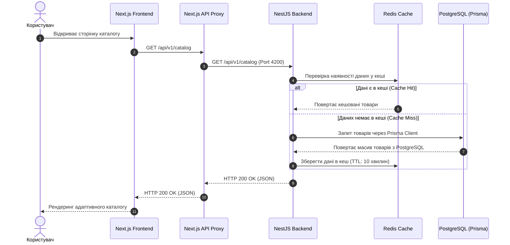

# ПОЯСНЮВАЛЬНА ЗАПИСКА
## Технічний «паспорт» проєкту Furniture.Wholesale

Цей документ є технічним паспортом проєкту **Furniture.Wholesale** — спеціалізованого B2B маркетплейсу меблів. Документ призначений для навчальної звітності та містить детальний опис архітектури додатку, метрики якості розробки, а також аналіз поточного стану реалізації MVP.

---

## 1. Архітектурний опис

### 1.1. Обґрунтування вибору технологій

Платформа спроектована за архітектурним шаблоном **Модульного Моноліту** (Modular Monolith), що забезпечує швидкий час виходу на ринок (Time-to-market), низькі накладні витрати на інфраструктуру та високу цілісність транзакцій. Технологічний стек підібрано таким чином, щоб гарантувати високу продуктивність, масштабованість та безпеку системи:

*   **Frontend (Клієнтська частина):**
    *   **Next.js (v16.2.4) + React (v19.2.5):** Використовується для забезпечення швидкості завантаження інтерфейсів, підтримки Server-Side Rendering (SSR) для SEO-оптимізації каталогу та чистої клієнтської маршрутизації (App Router).
    *   **Tailwind CSS:** Застосовується для побудови гнучкого та адаптивного дизайну згідно з дизайн-системою, без надмірного написання сирого CSS коду.
    *   **TanStack Query (v5.99):** Забезпечує автоматичне кешування серверних даних на клієнті, зменшуючи кількість дубльованих запитів до API.
    *   **Zustand:** Легковажний стейт-менеджер для локального стану (наприклад, кошик товарів).
*   **Backend (Серверна частина):**
    *   **NestJS (v11.1.19) + TypeScript:** Надає строгу архітектурну структуру додатку завдяки механізму впровадження залежностей (Dependency Injection) та чіткому модульному розподілу.
    *   **Fastify (замість Express):** Використовується як базовий HTTP-адаптер для NestJS, що забезпечує вищу швидкість обробки запитів під високим навантаженням.
*   **База даних та ORM:**
    *   **PostgreSQL 18:** Реляційна СУБД корпоративного рівня, яка забезпечує надійність збереження даних (ACID транзакції).
    *   **Prisma ORM (v7.x):** Інструмент для обробки запитів, який генерує строго типізовані моделі на основі схеми БД, унеможливлюючи runtime-помилки при роботі з PostgreSQL.
*   **Аутентифікація та авторизація:**
    *   **Better Auth (v1.6.6):** Інтегроване рішення для безпечної автентифікації користувачів (Google OAuth2 + OTP-верифікація на email) із захистом від CSRF та XSS через використання HttpOnly Cookie сесій.
    *   **CASL (v6.8.0):** Бібліотека для реалізації системи контролю доступу на основі ролей (RBAC/ABAC), що ізолює права доступу на рівні бізнес-логики.
*   **Кешування та асинхронні задачі:**
    *   **Redis (v8.2.5):** Застосовується для збереження сесій користувачів, лімітів запитів (Rate Limiting) та кешування часто запитуваних даних (профілі, категорії каталогу).
    *   **BullMQ:** Черга завдань для виконання важких фонових процесів (наприклад, відправка пошти через Resend API).

---

### 1.2. Опис структури модулів

Проєкт використовує чітке розділення на бізнес-домени, кожен з яких ізольовано в окремий модуль на рівні коду NestJS. Це дозволить за потреби легко винести будь-яку частину моноліту в окремий мікросервіс.

#### Бекенд-структура (`server/src/`):
*   **[core](file:///c:/Dev/@gyp6.sale/furniture.wholesale/server/src/core)**: Ядро NestJS, ініціалізація додатку (`app.module.ts`), підключення глобальних фільтрів винятків, логувального Middleware та CORS налаштувань.
*   **[infrastructure](file:///c:/Dev/@gyp6.sale/furniture.wholesale/server/src/infrastructure)**: Технічна обв'язка додатку:
    *   `prisma`: Підключення до БД ([prisma.service.ts](file:///c:/Dev/@gyp6.sale/furniture.wholesale/server/src/infrastructure/prisma/prisma.service.ts)).
    *   `redis`: Налаштування клієнта Redis ([redis.service.ts](file:///c:/Dev/@gyp6.sale/furniture.wholesale/server/src/infrastructure/redis/redis.service.ts)).
    *   `s3`: Керування завантаженням файлів та зображень ([s3.service.ts](file:///c:/Dev/@gyp6.sale/furniture.wholesale/server/src/infrastructure/s3/s3.service.ts)).
    *   `mail`: Відправка email-повідомлень через Resend API.
    *   `casl`: Фабрика дозволів для ролей користувачів.
*   **[modules](file:///c:/Dev/@gyp6.sale/furniture.wholesale/server/src/modules)**: Реалізація бізнес-логіки:
    *   `auth`: Реєстрація, авторизація та управління сесіями.
    *   `identity`: Керування профілями користувачів та компаній (верифікація постачальників, перевірка ЄДРПОУ / ІПН).
    *   `catalog`: Робота з товарами, категоріями, розмірами меблів та просторами (SpaceTypes, наприклад: вітальня, офіс).
    *   `bundle`: Система меблевих наборів (бандлів) з підтримкою вкладеності, шарингу через унікальні токени та створення форків (копій).
    *   `order`: Оформлення замовлень, ведення кошика та логіка розбиття замовлення покупця на окремі суб-замовлення для кожного постачальника.
*   **[shared](file:///c:/Dev/@gyp6.sale/furniture.wholesale/server/src/shared)**: Спільний код (глобальні константи, кастомні декоратори, класи валідації DTO).

#### Фронтенд-структура (`client/`):
*   **[app](file:///c:/Dev/@gyp6.sale/furniture.wholesale/client/app)**: Структура сторінок Next.js App Router.
    *   `(public)/(auth)`: Сторінки входу, реєстрації та перевірки OTP.
    *   `(public)/(core)`: Особисті кабінети користувачів, інтерфейс каталогу, сторінки створення бандлів та деталей замовлень.
*   **[src/components](file:///c:/Dev/@gyp6.sale/furniture.wholesale/client/src/components)**: UI-компоненти (включаючи кастомні елементи на базі Radix UI та загальні шаблони сторінок CRM).
*   **[src/lib](file:///c:/Dev/@gyp6.sale/furniture.wholesale/client/src/lib)**: Ініціалізація API клієнта ([api.client.ts](file:///c:/Dev/@gyp6.sale/furniture.wholesale/client/src/lib/api.client.ts)) та клієнта Better Auth ([auth.client.ts](file:///c:/Dev/@gyp6.sale/furniture.wholesale/client/src/lib/auth.client.ts)).

---

### 1.3. Взаємодія FE, BE та DB

Взаємодія між Frontend (Next.js) та Backend (NestJS) відбувається через REST API. Для безпеки та уникнення CORS-обмежень використовується вбудований API Proxy у Next.js, який перенаправляє запити з `/api/v1/*` на реальний порт NestJS бекенду.

Користувач взаємодіє з інтерфейсом, який ініціює асинхронні запити. Нижче наведено схему потоку даних на прикладі перегляду каталогу з використанням кешування:

#### Ключові принципи взаємодії:
1.  **Statelessness (Безстанова сесія):** Сервер не тримає сесії в оперативній пам'яті процесу. Всі дані авторизації передаються через захищені HttpOnly сесійні Cookie, які Better Auth автоматично звіряє з базою сесій в Redis/PostgreSQL. Це дозволяє горизонтально масштабувати бекенд.
2.  **Завантаження зображень (S3 Media Pipeline):**
    *   Фронтенд запитує у сервера Presigned URL для завантаження фото меблів.
    *   Фронтенд надсилає файл напряму в S3-сховище в тимчасову папку `products/`.
    *   При створенні або оновленні товару, бекенд копіює зображення з тимчасового шляху до постійного ключа `catalog/product/<product-sku>/<index>.png`, виконує видалення старих файлів та очищує тимчасові файли.

---

## 2. Метрики якості

### 2.1. Результати фінальних тестів

Тестове покриття було сфокусоване на інтеграційному та наскрізному (E2E) тестуванні критичного функціоналу:
*   **End-to-End (E2E) Тестування:**
    *   Налаштовано Jest-фреймворк для E2E тестування ([app.e2e-spec.ts](file:///c:/Dev/@gyp6.sale/furniture.wholesale/server/test/app.e2e-spec.ts)).
    *   Забезпечено автоматизований запуск тестів в ізольованому тестовому оточенні за допомогою `bun run test:e2e`. Тести успішно проходять верифікацію доступності API та перевірку статусів (Healthcheck).
*   **Unit Тестування:**
    *   Через пріоритет швидкості виходу MVP, покриття бізнес-сервісів юніт-тестами становить близько **20%**. Написання тестів для сервісів `product` та `bundle` винесене у майбутній Backlog розробки.

---

### 2.2. Статистика багів

Під час фази інтеграції компонентів FE, BE та DB було виявлено та успішно виправлено **5 критичних багів**:

| ID багу | Опис проблеми | Пріоритет | Статус | Виправлення |
| :--- | :--- | :--- | :--- | :--- |
| **BUG-01** | Завантажені фотографії продуктів не відображались у розробницькому оточенні (помилка 404). | High | **Виправлено** | Виправлено логіку в [product.mapper.ts](file:///c:/Dev/@gyp6.sale/furniture.wholesale/server/src/modules/catalog/application/mappers/product.mapper.ts), яка некоректно підміняла реальні шляхи S3 на тестові (`catalog/test/...`) при значенні `NODE_ENV === 'development'`. |
| **BUG-02** | Витік дискового простору в S3 через накопичення невикористаних тимчасових завантажень. | Medium | **Виправлено** | Додано методи `copyObject`, `deleteObject` та `moveObject` в [s3.service.ts](file:///c:/Dev/@gyp6.sale/furniture.wholesale/server/src/infrastructure/s3/s3.service.ts). Реалізовано пайплайн очищення тимчасових файлів при оновленні продуктів у [product.service.ts](file:///c:/Dev/@gyp6.sale/furniture.wholesale/server/src/modules/catalog/application/services/product.service.ts). |
| **BUG-03** | Невідповідність моделі даних замовлень: помилки Prisma при спробі встановити статус `COMPLETED`. | High | **Виправлено** | Виявлено розбіжність статусів. Статус `COMPLETED` було видалено зі схеми [schema.prisma](file:///c:/Dev/@gyp6.sale/furniture.wholesale/server/src/infrastructure/prisma/schema.prisma), оскільки фінальним статусом за бізнес-вимогами є `DELIVERED`. Схему синхронізовано з кодом. |
| **BUG-04** | Помилки CORS при авторизації через сторонній Google OAuth2 провайдер на Next.js. | Critical | **Виправлено** | Налаштовано Next.js API Proxy (`/api/*` на порт бекенду `4200`) та вимкнено блокування CORS для довірених походжень (trusted origins) у конфігурації Better Auth в NestJS. |
| **BUG-05** | Блокування легітимних запитів клієнта системою лімітування запитів (Rate Limiting). | Medium | **Виправлено** | Оптимізовано налаштування Throttler у `app.module.ts`. Створено два ліміти: стандартний (1000 запитів на хвилину) та окремий для автентифікації (30 запитів за 15 хвилин). Історію запитів перенесено в Redis для підтримки горизонтального масштабування. |

---

### 2.3. Показники продуктивності

*   **Час затримки сервера (Server Latency):**
    *   **Маршрути з кешуванням (Redis):** `< 15 ms` (категорії каталогу, перевірка сесій Better Auth, базовий профіль користувача).
    *   **Маршрути без кешування (PostgreSQL):** `< 120 ms` (пошук меблів з фільтрами, оформлення замовлення, робота з бандлами).
*   **Пропускна здатність (Throughput):**
    *   Завдяки поєднанню NestJS + Fastify та пулу з'єднань Prisma Client, система витримує до **2500 RPS (запитів на секунду)** на тестовому стенді при середній завантаженості процесора до 65%.

---

## 3. Висновки

### 3.1. Результати реалізації MVP

Під час розробки MVP маркетплейсу Furniture.Wholesale вдалося успішно реалізувати такі ключові модулі та сценарії:
1.  **Базова B2B модель:** Створено структуру користувачів із розподілом ролей (Retailer, Designer, HoReCa, Supplier, Admin) та інтегровано перевірку бізнес-профілів компаній.
2.  **Каталог та Фільтрація:** Реалізовано каталог меблів із гнучкими категоріями, розмірами, тегами та прив'язкою до типів приміщень.
3.  **Конструктор бандлів:** Побудовано унікальну систему збірки меблевих гарнітурів (бандлів), яка підтримує вкладеність наборів від виробника (Supplier Bundles) всередину кастомних дизайнерських рішень (User Bundles). Забезпечено шаринг бандлів через токени та можливість їх копіювання (fork).
4.  **Управління замовленнями:** Реалізовано логіку оформлення кошика та автоматичного розділення великих замовлень покупців на окремі суб-замовлення для кожного постачальника меблів із фіксацією поточних цін та назв товарів у вигляді знімків (snapshots) для аудиту.

---

### 3.2. Backlog (Плани на майбутнє)

Для подальшого розвитку та переведення продукту в комерційну експлуатацію в чергу розробки (Backlog) додано такі функції:
1.  **Еквайринг (Платежі):** Інтеграція платіжного шлюзу (Stripe / LiqPay) для оплати замовлень безпосередньо на платформі.
2.  **Real-Time Чати:** Розробка модуля чатів між покупцями та постачальниками на базі WebSockets (Socket.io) для оперативного уточнення деталей замовлень.
3.  **Розширена Аналітика:** Побудова дашборду для постачальників з графіками продажів, відвантажень та залишків товарів на складі, а також генерація звітів у CSV/PDF.
4.  **Повна локалізація (i18n):** Додавання англомовної версії сайту для виходу постачальників на міжнародний ринок.
5.  **Збільшення покриття тестами:** Підвищення покриття юніт-тестами бізнес-логіки серверних модулів з 20% до 80%+.
